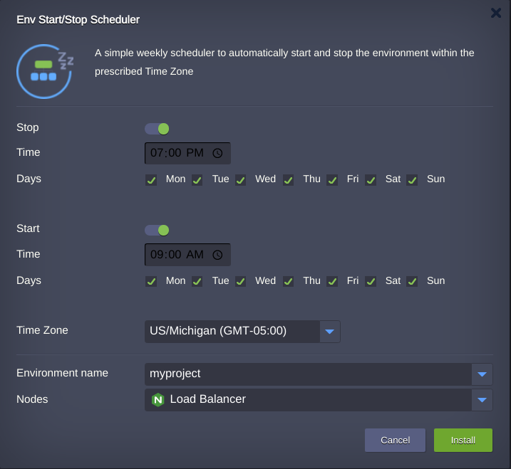
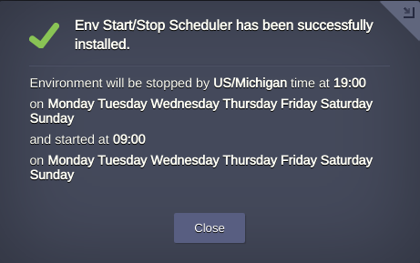
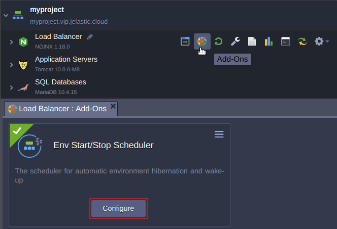

# Environment Start/Stop Scheduler Add-On

The **Env Start/Stop Scheduler** add-on is intended to automatically shut down and relaunch an environment based on the prescribed timing instructions. The schedule is tied to the [Time Zones](https://en.wikipedia.org/wiki/Time_zone).  Such automated environment lifecycle management allows to cut spends on testing and dev projects by turning them off when no development is carried out (e.g. during nighttime or weekend).

The scheduler can be applied to any environment within your [Jelastic Cloud](https://jelastic.cloud/) account.

For more information about [Jelastic Add-Ons](https://github.com/jelastic-jps/jpswiki/wiki/Jelastic-Addons) and their usage, refer to the linked guide.

## How to Apply Environment Start/Stop Scheduling

Copy link to the **_manifest.jps_** file above and [import](https://docs.jelastic.com/environment-import) it to your Jelastic dashboard (or, alternatively, locate and launch this package via [Jelastic Marketplace](https://docs.jelastic.com/marketplace)).

Within the installation frame:
- enable/disable environment **stop** action  
- specify at what time the environment must be stopped  
- check/uncheck the days of the week the stop action to be applied  
- enable/disable environment **start** action  
- specify at what time the environment must be stopped  
- check/uncheck the days of the week the stop action to be applied  
- pick the **Time Zone** in which the actions must be performed  
- **Environment name** - target environment that should be managed by add-on  
- **Nodes** - [environment layer](https://docs.jelastic.com/jelastic-basic-hosting-concepts#layer) the add-on will be installed to; is fetched automatically upon selecting the environment and should be left unchanged  

> **Note** that the current scheduler implementation implies the complete stop of all containers in the destination environment (rather than container [hibernation](https://docs.jelastic.com/resources-utilization), which can be automatically interrupted upon any incoming request); thus, all the corresponding environment services will remain unavailable until it is launched again, either by the scheduler or manually.            

Click **Install** to initiate the scheduler integration.

The installation results in the confirmation window:

## Managing Start/Stop Scheduler

In case you need to change the initial *Stop* and *Start* trigger conditions, click the **Add-ons** button next to the server it was installed to and select **Configure** at the appropriate scheduler plank (alternatively, the same could be applied with add-on re-installation).

In case this solution is not needed any more, use the menu at the top-right corner of the same plank to **Uninstall** it.

For more details and tips on Environment Start/Stop Scheduler usage, refer to the linked [guide](http://blog.jelastic.com/2017/05/18/start-stop-environment-scheduler-save-cloud-costs/).
